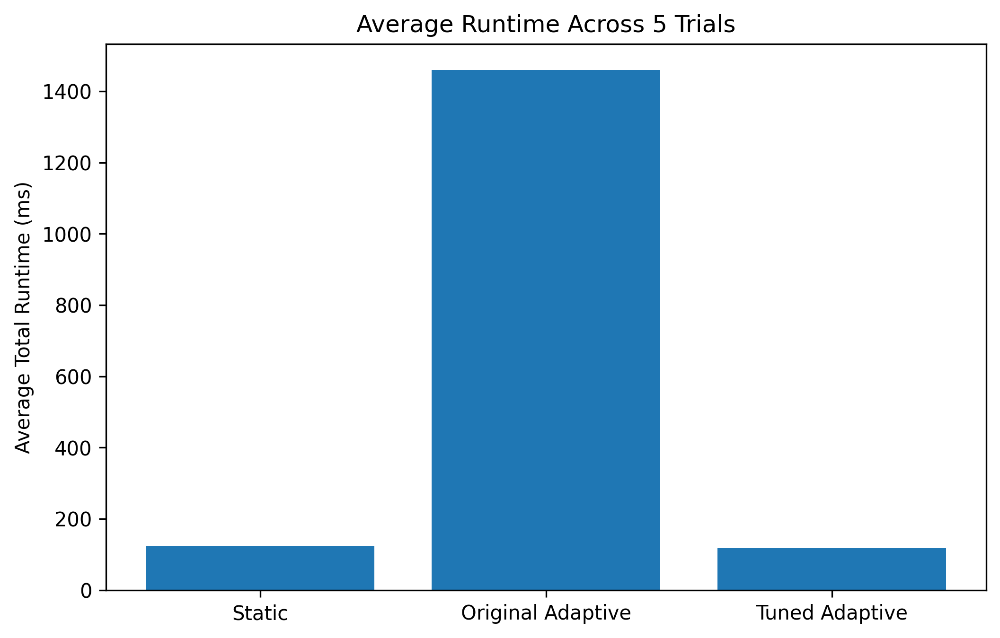
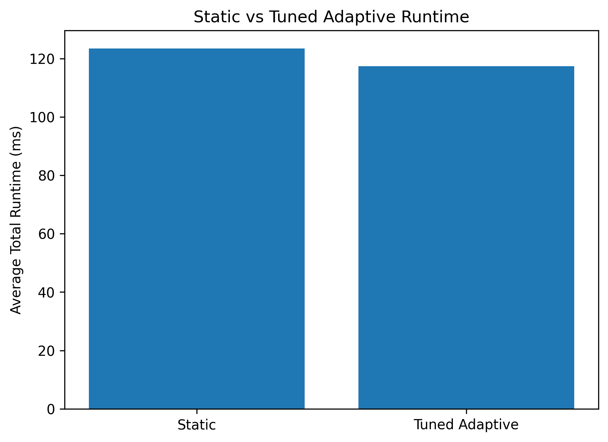
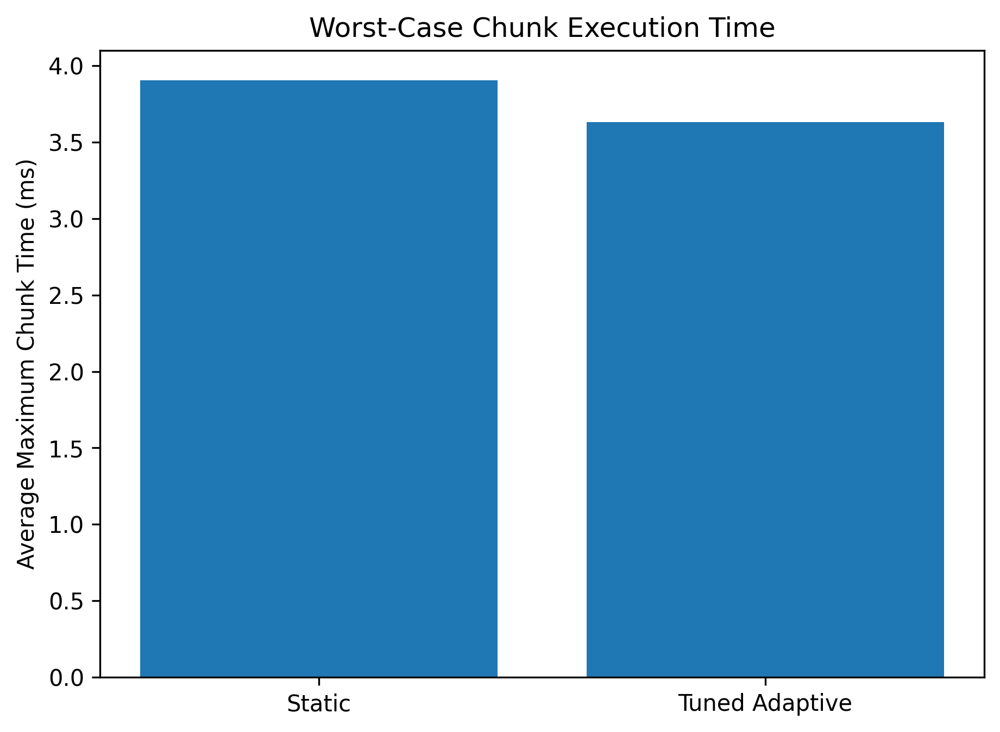

\# Variance-Aware Adaptive GPU Chunking


\## Overview


This project investigates whether dynamically adjusting GPU workload chunk sizes based on execution-time variance can improve performance stability compared with fixed-size static chunking.


The project implements and evaluates three scheduling approaches:


1\. Static Chunking

2\. Original Variance-Aware Adaptive Chunking

3\. Tuned Variance-Aware Adaptive Chunking


The experiments use an irregular GPU workload implemented with CUDA and evaluate runtime, execution-time variability, and worst-case chunk latency across multiple trials.


\---


\## Objective


GPU workloads can exhibit execution-time variation due to irregular computational workloads and runtime fluctuations.


This project explores whether chunk sizes can be dynamically adjusted using recent execution-time variance.


The goal is to reduce:


\- Overall execution time

\- Chunk execution-time variability

\- Worst-case chunk execution time


while avoiding excessive kernel-launch overhead.


\---


\## Static Chunking


The baseline implementation divides the workload into fixed-size chunks.


Configuration:


\- Total tasks: 5,000,000

\- Fixed chunk size: 100,000 tasks

\- Kernel repetitions per chunk: 1,000

\- CUDA threads per block: 256


Since the chunk size remains fixed, the scheduler does not respond to execution-time variation.


\---


\## Initial Variance-Aware Adaptive Chunking


The initial adaptive approach measured execution times using a sliding window.


For each chunk:


1\. Measure chunk execution time.

2\. Add the execution time to a sliding window.

3\. Calculate variance across the window.

4\. Reduce the chunk size when variance exceeds a threshold.

5\. Increase the chunk size when variance remains low.


Initial configuration:


\- Initial chunk size: 50,000

\- Minimum chunk size: 5,000

\- Maximum chunk size: 200,000

\- Variance window: 5 measurements

\- High variance threshold: 0.20 ms²

\- Low variance threshold: 0.05 ms²


\### Initial Result


The controller was overly sensitive to normal GPU timing fluctuations.


Repeated variance triggers caused aggressive chunk-size reductions, producing hundreds of small chunks and significantly increasing kernel-launch overhead.


Across five trials:


\- Average runtime: 1459.90 ms

\- Average timing standard deviation: 0.652 ms

\- Average maximum chunk time: 4.556 ms


This demonstrated that adaptive scheduling can perform poorly when the controller reacts too aggressively to noisy measurements.


\---


\## Tuned Variance-Aware Adaptive Chunking


The adaptive controller was modified to reduce excessive reactions to timing noise.


Changes included:


\- Increased variance thresholds

\- Initial chunk size changed to 100,000

\- Minimum chunk size increased to 25,000

\- Gradual chunk reduction instead of halving

\- Cooldown period after each adjustment


The controller used the following strategy:


\- High variance: reduce chunk size gradually

\- Low variance: increase chunk size gradually

\- Cooldown: prevent repeated adjustments across consecutive windows


This reduced excessive fragmentation and kernel-launch overhead.


\---


\## Experimental Setup


Each scheduling strategy was tested across five trials.


\### Workload


The GPU workload assigns varying amounts of computation to different tasks:


```text

work = 500 + (task\_index % 5000)
```


This means that different tasks perform different amounts of computation, creating an irregular GPU workload.


The workload is processed using a CUDA kernel, where each task performs a number of iterations determined by its assigned `work` value.


\### Metrics


The following metrics were measured across the experiments:


\- Total runtime

\- Mean chunk execution time

\- Standard deviation of chunk execution time

\- Maximum chunk execution time

\- Number of chunks processed

\- Average chunk size


\---


\## Results


Each scheduling approach was evaluated across five trials.


| Method | Average Total Runtime (ms) | Average Chunk Time Std Dev (ms) | Average Maximum Chunk Time (ms) |

|---|---:|---:|---:|

| Static Chunking | 123.454 | 0.603 | 3.905 |

| Original Adaptive | 1459.896 | 0.652 | 4.556 |

| Tuned Adaptive | \*\*117.359\*\* | \*\*0.567\*\* | \*\*3.630\*\* |


\### Runtime


The original adaptive approach performed significantly worse than static chunking. Its aggressive response to variance caused the workload to be divided into a large number of small chunks, increasing kernel-launch overhead.


The tuned adaptive approach avoided this excessive fragmentation and achieved a lower average runtime than the static baseline.


\### Stability


The tuned adaptive approach also produced a lower average chunk execution-time standard deviation than both the static and original adaptive approaches.


\- Static: 0.603 ms

\- Original Adaptive: 0.652 ms

\- Tuned Adaptive: 0.567 ms


\### Worst-Case Chunk Execution Time


The tuned adaptive approach also achieved the lowest average maximum chunk execution time.


\- Static: 3.905 ms

\- Original Adaptive: 4.556 ms

\- Tuned Adaptive: 3.630 ms


\---


\## Key Findings


The experiments demonstrate that adaptive GPU chunking is highly sensitive to controller design.


The initial variance-aware controller reacted too aggressively to execution-time fluctuations. This caused repeated reductions in chunk size, resulting in excessive workload fragmentation and increased kernel-launch overhead.


The tuned controller reduced this excessive adaptation and maintained chunk sizes closer to the static baseline.


Across five trials, the tuned adaptive approach achieved:


\- Lower average total runtime than static chunking

\- Lower chunk execution-time variability

\- Lower average worst-case chunk execution time


The original adaptive implementation demonstrates that simply reacting to execution-time variance does not automatically improve performance. The adaptation mechanism must be carefully tuned to distinguish meaningful workload variation from normal timing noise.


\---


\## Conclusion


This project implemented and evaluated a variance-aware adaptive GPU chunking strategy using CUDA.


The results show two important outcomes.


First, an overly sensitive adaptive controller can significantly degrade performance by generating too many small chunks and increasing kernel-launch overhead.


Second, after tuning the adaptation behaviour, the variance-aware approach achieved better results than the fixed-size static baseline in terms of average runtime, chunk execution-time variability, and worst-case chunk execution time.


The tuned adaptive approach achieved an average runtime of \*\*117.359 ms\*\*, compared with \*\*123.454 ms\*\* for static chunking.


This represents an improvement of approximately \*\*4.9%\*\* in average total runtime.


The main conclusion is that adaptive scheduling can improve GPU workload execution, but its effectiveness depends strongly on the design and tuning of the adaptation controller.

---

## Project Structure

```text
variance_gpu_project/
│
├── src/
│   ├── static_chunking.cu
│   └── variance_chunking.cu
│
├── data/
│   ├── static_trial_1.csv
│   ├── static_trial_2.csv
│   ├── static_trial_3.csv
│   ├── static_trial_4.csv
│   ├── static_trial_5.csv
│   │
│   ├── adaptive_trial_1.csv
│   ├── adaptive_trial_2.csv
│   ├── adaptive_trial_3.csv
│   ├── adaptive_trial_4.csv
│   ├── adaptive_trial_5.csv
│   │
│   ├── adaptive_tuned_trial_1.csv
│   ├── adaptive_tuned_trial_2.csv
│   ├── adaptive_tuned_trial_3.csv
│   ├── adaptive_tuned_trial_4.csv
│   └── adaptive_tuned_trial_5.csv
│
├── analysis/
│   └── pp.ipynb
│
└── README.md
```
---

## Requirements

The project requires:

- NVIDIA GPU with CUDA support
- NVIDIA CUDA Toolkit
- Microsoft C++ Build Tools or Visual Studio C++ compiler
- Python 3
- Jupyter Notebook

Python packages used for analysis:

```bash
pip install pandas matplotlib
```

---

## Compilation

Navigate to the `src` directory:

```bash
cd variance_gpu_project/src
```

Compile the static implementation:

```bash
nvcc -allow-unsupported-compiler static_chunking.cu -o static_chunking.exe
```

Compile the adaptive implementation:

```bash
nvcc -allow-unsupported-compiler variance_chunking.cu -o variance_chunking.exe
```

The `-allow-unsupported-compiler` flag was required in the experimental environment because the installed Microsoft Visual Studio compiler version was newer than the CUDA Toolkit's officially supported version.

---

## Running the Experiments

Each implementation accepts a trial number as a command-line argument.

Run a static chunking trial:

```bash
static_chunking.exe 1
```

Run an adaptive chunking trial:

```bash
variance_chunking.exe 1
```

The trial number is used to generate separate CSV output files for each experiment.

Each scheduling approach was executed for five trials.

The generated CSV files are stored in the `data` directory and can be analysed using:

```text
analysis/pp.ipynb
```
---

## Results Visualizations

### Average Runtime Across All Methods



The original adaptive controller performed significantly worse because aggressive chunk-size reductions caused excessive kernel-launch overhead. The tuned adaptive approach achieved the lowest average runtime.

### Static vs Tuned Adaptive Runtime



The tuned adaptive scheduler achieved approximately **4.9% lower average runtime** compared with the fixed-size static baseline.

### Chunk Execution-Time Variability


The tuned adaptive approach produced lower average chunk execution-time variability than the static baseline.

### Worst-Case Chunk Execution Time



The tuned adaptive implementation also achieved a lower average maximum chunk execution time.
